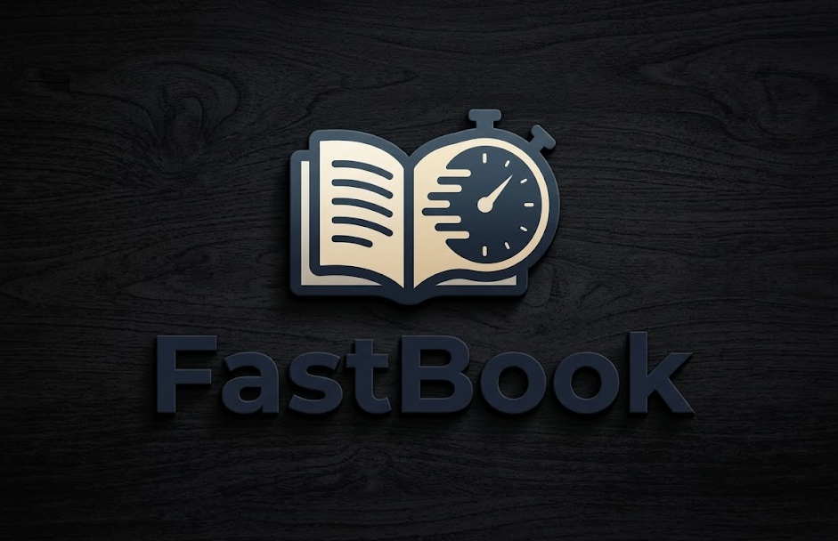

#<p align="center">
  <br>
  <h3>FastBook</h3>
</p>

<p align="center">
  <strong>A lightweight personal note management system built with WPF and MVVM.</strong>
</p>

<p align="center">
  
  
  
</p>

---

## 🛠 Project Overview
**FastBook** is a desktop application designed for efficient note-taking and organization. It focuses on speed, a clean user interface, and robust data management using Entity Framework Core with SQLite.

> [!IMPORTANT]
> **Status:** This project is currently in **Active Development**. New features are being added regularly, and the architecture is being refined.

---

## ✨ Key Features
* **Note Management:** Full CRUD operations (Create, Read, Update, Delete) for your personal thoughts and tasks.
* **Tagging System:** Flexible categorization of notes using a custom tagging engine.
* **LINQ-Powered Search:** Fast and efficient filtering across your entire note library.
* **Local Storage:** Powered by **SQLite** for zero-configuration, offline-first reliability.
* **Modern UI/UX:** Custom-styled WPF controls with integrated sound feedback for a tactile experience.

---

## 💻 Tech Stack
* **Language:** C# 12 / .NET 10
* **Framework:** WPF (Windows Presentation Foundation)
* **Pattern:** MVVM (Model-View-ViewModel)
* **ORM:** Entity Framework Core
* **Database:** SQLite

---

## 🚀 Getting Started

### Prerequisites
* Visual Studio 2022 (with .NET 10 SDK)

### Installation
1. **Clone the repository**:
   ```bash
   git clone [https://github.com/SadNapp/FastBook.git](https://github.com/SadNapp/FastBook.git)
Open the solution in Visual Studio.

Restore NuGet packages:

Bash
dotnet restore
Run the application: Press F5. The database will be automatically initialized on the first launch.

🏗 Architecture
The project follows a clean separation of concerns:

Models: Data entities (Note, Tag).

ViewModels: Logic handling and UI interaction.

Services: Data access layer (NoteService) to encapsulate DB logic.

Views: XAML-based interface definitions.


